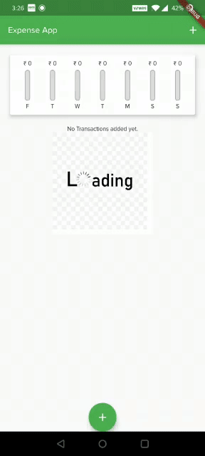

# Personal Expense App

## Goals Accomplished
[x] Created StateFul Management of Data.

[x] Implemented Map, Getter and List, alternatives to lambda expressions

[x] Created Bar Charts by Stacking Widgets.

[x] Implemented External Package.

[x] Implemented Alternative and Hidden Widgets.

